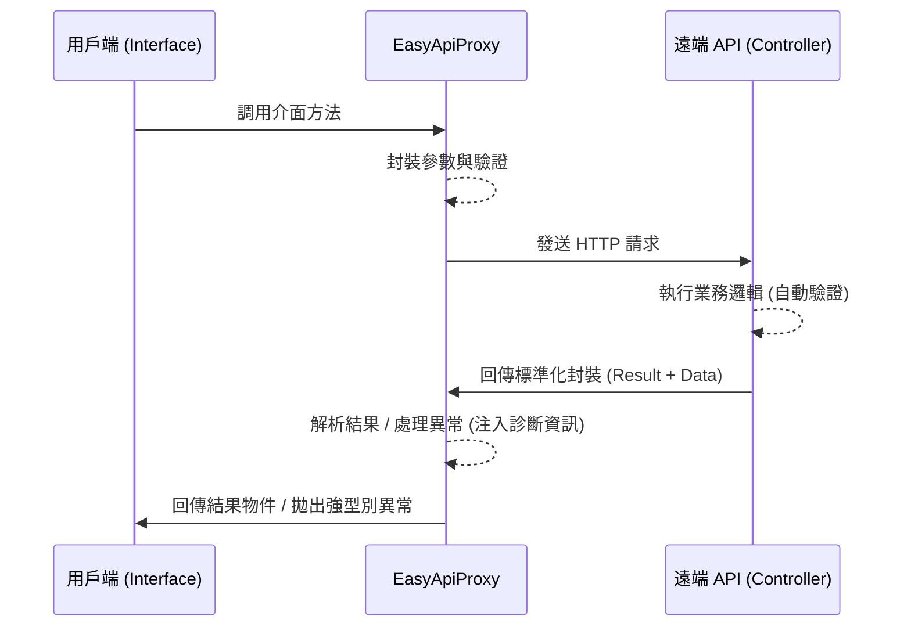

# EasyApiProxy

[](https://www.nuget.org/packages/EasyApiProxy/)
[](https://github.com/shengwen2000/EasyInjector/blob/master/LICENSE)

**EasyApiProxy** 是一個專為 .NET 開發者設計的輕量級遠端 API 代理框架。透過「介面導向」的開發模式，將 API 調用簡化，同時在跨平台相容性與診斷自動化上提供穩定的支持。

---

## 🚀 核心亮點 (Highlights)

| 特性 | 說明 | 開發者價值 |
| :--- | :--- | :--- |
| **介面導向開發** | 使用強型別 Interface 定義 API，無需撰寫具體的調用實作。 | 零樣板代碼，API 定義即文檔。 |
| **一站式診斷上下文** | 異常發生時自動匯集 TraceId、URL、Method 與狀態碼。 | 診斷毫不費力，無需翻找日誌即可定位問題。 |
| **宣告式狀態碼管理** | 透過 Attribute 在 Enum 或 Action 上優雅管理 HTTP 狀態。 | 業務邏輯與通訊層解耦，代碼更潔淨。 |
| **跨時代混血架構** | 在 .NET Core 與 .NET Framework 之間提供完全一致的 API。 | 舊系統無痛升級，技能完美遷移。 |
| **自動化模型驗證** | Filter 自動截獲 `ModelState` 錯誤並進行標準化封裝。 | 徹底擺脫重複的 `if(!ModelState.IsValid)`。 |

---

## 🛠 調用流程 (Workflow)



---

## 📝 快速上手 (Getting Started)

### 1. 定義 API 介面
```csharp
public interface IDemoApi
{
    [HttpPost]
    Task<AccountInfo> Login(Login req);

    [HttpGet]
    Task<string> GetServerInfo();
}
```

### 2. 用戶端呼叫
```csharp
// 建立工廠 (建議 Singleton 重複使用以維護 HttpClient 效能)
var factory = new ApiProxyBuilder()
    .UseDefaultApiProtocol("http://api.myserver.com/api/Demo")
    .Build<IDemoApi>();

// 建立代理物件並呼叫
using (var proxy = factory.Create()) 
{
    var result = await proxy.Api.Login(new Login { Account = "admin", Password = "..." });
    Console.WriteLine($"Token: {result.Token}");
}
```

---

---

## 🛰️ DefaultApi 通訊協議規範

`DefaultApi` 是一套標準化的 JSON 請求/回應協議，確保前端代理與後端服務之間的行為一致。

### 1. 請求 (Request) 規範
*   **傳輸格式**：固定使用 `POST` 方法與 `application/json`。
*   **參數限制**：
    *   介面方法定義 **「只能零參數或單一參數」**。
    *   強烈建議將輸入參數包裝成一個 **「物件 (Class)」**，以利後續功能的擴充（如增減欄位）。
*   **JSON 序列化**：
    *   **命名慣例**：使用 `CamelCase` (小駝峰)。
    *   **日期格式**：固定為 `yyyy-MM-ddTHH:mm:ss`。
        *   ⚠️ **注意**：此格式不包含時區與毫秒。在跨時區部署或對時間精度要求極高的場景下，請確保伺服器與用戶端系統時區一致，或於業務邏輯層進行 UTC 轉換處理。

### 2. 回應 (Response) 規範
*   **標準封裝**：所有回應都會被封裝在一個包含 `Result`、`Message`、`Data` 的結構中。
*   **特定 Header**：
    *   `X-Api-Result`: 代表執行代號（如 `OK` 代表成功、`IM` 代表驗證失敗、`EX` 代表系統異常）。
    *   `X-Api-DataType`: 代表 `Data` 欄位的資料型別。

---

## 🖥️ 後端服務實作 (Server-side Implementation)

### 1. .NET Core / .NET 6+ 實作
套用 `[DefaultApiResult]` 特性，自動處理物件封裝、模型驗證與例外轉碼。

```csharp
[ApiController]
[Route("api/[controller]/[action]")]
[DefaultApiResult] 
public class DemoController : ControllerBase
{
    [HttpPost]
    public async Task<AccountInfo> Login(LoginRequest req)
    {
        // 直接回傳物件，Filter 會自動封裝成 { Result: "OK", Data: ... }
        return new AccountInfo { Token = "..." };
    }
}
```

### 2. .NET 451 / OWIN 實作
在 Legacy 環境下，寫法與 .NET Core 幾乎完全一致。

```csharp
[DefaultApiResult]
public class DemoApiController : ApiController
{
    [HttpPost]
    public async Task<AccountInfo> Login(LoginRequest req)
    {
        // 與 Core 一致，直接回傳強型別物件
        return new AccountInfo { Token = "..." };
    }
}

// Startup 設定
public void Configuration(IAppBuilder app)
{
    var config = new HttpConfiguration();
    config.MapHttpAttributeRoutes();
    // 必須套用 DefaultApi JSON 設定控製序列化
    config.Formatters.JsonFormatter.SerializerSettings = DefaultApiExtension.DefaultJsonSerializerSettings;
    app.UseWebApi(config);
}
```

---

## 🔗 用戶端整合與呼叫 (Client-side Integration)

### 1. 定義 API 介面
API 定義應作為共用專案（或讓 Client 參考），確保強型別一致。
```csharp
public interface IDemoApi
{
    // 單一參數物件化是最佳實踐
    Task<AccountInfo> Login(LoginRequest req);
}
```

### 2. .NET Core 整合 (DI)
```csharp
services.AddApiProxy<IDemoApi>((sp, builder) =>
{
    builder.UseDefaultApiProtocol("http://api.myserver.com/api/Demo");
});
```

### 3. .NET 451 / Legacy 整合 (EasyInjector)
```csharp
var injector = new EasyInjector();
injector.AddApiProxy<IDemoApi>((sp, builder) =>
    builder.UseDefaultApiProtocol("http://localhost:8081/api/Demo"));

// 取得服務
var api = injector.CreateScope().ServiceProvider.GetRequiredService<IDemoApi>();
```

### 4. 動態服務切換 (本地 vs. 遠端)
支援根據配置決定使用本地實作或遠端代理服務：

```csharp
injector.AddApiProxy<IDemoApi>((sp, builder) => 
{
    var opt = sp.GetRequiredService<AppOptions>();
    
    if (string.IsNullOrEmpty(opt.ApiUrl))
    {
        // 模式 A: 使用本地實作 (Local Implementation)
        builder.UseLocalApi<IDemoApi>(sp => new DemoServiceLocal());
    }
    else
    {
        // 模式 B: 使用遠端代理 (Remote Proxy)
        builder.UseDefaultApiProtocol(opt.ApiUrl);
    }
});
```

---

## 🛡️ 驗證機制 (Authentication)

### Bearer Token 驗證
```csharp
proxy.SetBearer("your_jwt_token_here");
```

### Basic 驗證
```csharp
builder.UseBasicAuthorize(new BasicCredential { Account = "...", PassCode = "..." });
```

---

## 🔍 診斷與異常處理 (Diagnostics)

當發生錯誤（如斷網、404 或 `X-Api-Result` 非 `OK`）時，系統會拋出 `ApiCodeException`，包含 `TraceId`、`TargetUrl` 等診斷上下文資訊。

---


## 忽略封裝處理
若特定法方需回傳原始資料（如檔案流），可使用 `[IgnoreApiResult]` 標註。

---

## 📦 安裝方式
*   **Core 核心**: `Install-Package EasyApiProxy`
*   **Web 端支持**: `Install-Package EasyApiProxy.WebApi`
